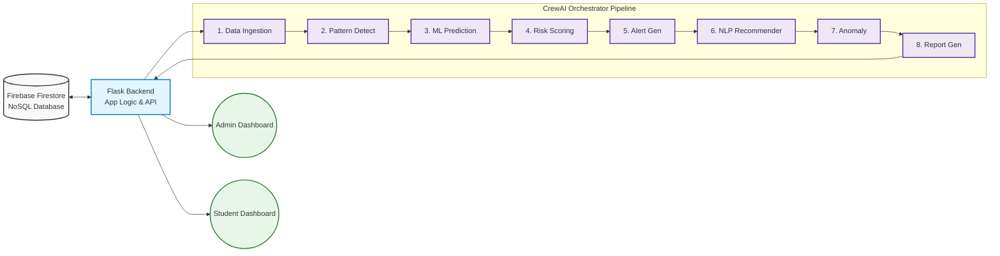

# AI-Powered Student Attendance Management System

## 🎓 Academic Details
- **Course:** Natural Language Processing (NLP)
- **Class:** Semester VI (Third Year Engineering)
- **College:** Pillai College of Engineering. You can learn more about the college by visiting the official website of Pillai College of Engineering. https://www.pce.ac.in/

## 📌 Overview
An AI-based Student Attendance Management System that uses autonomous AI agents to analyze attendance data, detect absence patterns, predict future attendance, assign risk levels, and generate personalized recommendations for at-risk students. The system provides separate dashboards for administrators and students, powered by a multi-agent pipeline built with CrewAI and Google Gemini.

## 🎯 Objective
Traditional attendance systems only record data, they don't act on it. This project solves that gap by building a proactive, AI-driven system that:
- Uses AI to study past attendance records.
- Identifies students who are at risk of falling below required attendance.
- Detects irregular patterns like frequent absences, subject avoidance, or declining engagement.
- Predicts future attendance percentages based on past data, exams, holidays, and timetable.
- Suggests personalized actions like mentoring, counseling, or extra academic support.
- Flags unusual cases such as sudden mass absences or abnormal attendance spikes.
- Helps administrators make data-driven decisions.
- Improves overall student engagement and academic performance


## 🧠 Technologies Used
- **Backend:** Python, Flask, Flask-Login
- **Database:** Google Firebase Firestore (NoSQL)
- **AI Framework:** CrewAI (multi-agent orchestration)
- **LLM:** Google Gemini (`gemini-2.5-flash-lite`) via LiteLLM
- **Data Processing:** Pandas
- **PDF Generation:** FPDF2
- **Frontend:** HTML5, Vanilla CSS, JavaScript, Jinja2 Templates
- **Deployment:** Gunicorn, Render

## 📊 Dataset
- Mock attendance data is generated via `seed.py`, simulating 30 days of attendance across multiple subjects for student profiles with varying attendance behaviors (consistent, moderate, and frequently absent students).
- In production, the system reads live attendance records from Firebase Firestore.

## ⚙️ Installation
Steps to run the project:

```bash
git clone https://github.com/krishv24/NLP-rewritten.git
cd NLP-rewritten
pip install -r requirements.txt
```

### Configuration
1. Create a `.env` file in the root directory (see `.envexample` for reference):
   ```
   FLASK_APP=run.py
   FLASK_ENV=development
   SECRET_KEY=your-secret-key-here
   GEMINI_API_KEY=your-google-gemini-api-key
   GEMINI_API_KEY_2=your-second-gemini-api-key (optional)
   ```
2. Place your Firebase service account credentials file as `firebase-credentials.json` in the root directory. This file is used to connect to Google Firebase Firestore — it is **not** the Gemini API key.
3. On first launch, the app will prompt you to enter your Gemini API key via the setup page if it is not already stored in the database.

## ▶️ Usage
```bash
# Run the application
python run.py

# Or use the batch script (Windows)
./start.bat
```
Navigate to `http://127.0.0.1:5000` in your browser.

**Default Credentials:**
| Role    | Email              | Password    |
|---------|--------------------|-------------|
| Admin   | admin@school.com   | admin123!   |
| Student | alice@school.com   | student123  |
| Student | bob@school.com     | student123  |

### Running the AI Analysis
1. Log in as Admin
2. Navigate to **Run Analysis**
3. Click **Start Analysis Now** — the 8 AI agents will process all student data, which takes 1–3 minutes
4. View results under **Reports**, **Alerts**, and individual **Student Detail** pages

## 📈 Results
- The multi-agent pipeline categorizes students into **Low**, **Medium**, **High**, and **Critical** risk tiers based on predicted attendance trends.
- NLP-generated personalized recommendations are delivered to at-risk students suggesting mentoring, counselor referrals, or extra classes.
- Mass-absence anomaly detection flags dates where over 40% of students were absent.
- Downloadable PDF reports with color-coded risk levels, attendance tables, and AI recommendations.

## 🎥 Demo Video
[YouTube link here]

## 👥 Team Members
- Name 1
- Name 2
- Name 3

## 📌 GitHub Contributions
- Name 1 – Contribution
- Name 2 – Contribution
- Name 3 – Contribution


# Process Flow Diagram

